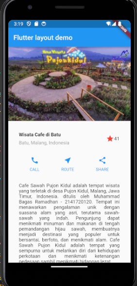

Nama : Muhammad Bagas Ramadhan
Kelas : 3G
NIM : 2141720120

# UTS

# Praktikum 1: Membangun Layout di Flutter

## Langkah 1: Buat Project Baru


## Langkah 2: Buka file lib/main.dart
### Buka file main.dart lalu ganti dengan kode berikut. Isi nama dan NIM Anda di text title.
```
import 'package:flutter/material.dart';

void main() => runApp(const MyApp());

class MyApp extends StatelessWidget {
  const MyApp({super.key});

  @override
  Widget build(BuildContext context) {
    return MaterialApp(
      title: 'Flutter layout: Nama dan NIM Anda',
      home: Scaffold(
        appBar: AppBar(
          title: const Text('Flutter layout demo'),
        ),
        body: const Center(
          child: Text('Hello World'),
        ),
      ),
    );
  }
}
```

### Hasil


## Langkah 3: Identifikasi layout diagram
Pada langkah ini dilakukan pemecahan layout menjadi elemen dasarnya:

• Identifikasi baris dan kolom

• Apakah tata letaknya menyertakan kisi-kisi (grid)?  

• Apakah ada elemen yang tumpang tindih?

• Apakah UI memerlukan tab?

• Perhatikan area yang memerlukan alignment, padding, atau borders.

Dalam hal ini menyusun elemen menjadi sebuah kolom: sebuah gambar, dua baris, dan satu blok teks. Selanjutnya, buat diagram setiap baris. Baris pertama, disebut bagian Judul, memiliki 3 anak: kolom teks, ikon bintang, dan angka. Anak pertamanya, kolom, berisi 2 baris teks. Kolom pertama itu memakan banyak ruang, sehingga harus dibungkus dengan widget yang diperluas. Baris kedua, disebut bagian Tombol, juga memiliki 3 anak: setiap anak merupakan kolom yang berisi ikon dan teks.

## Langkah 4: Implementasi title row
Menambahkan kode berikut di bagian atas metode build() di dalam kelas MyApp:
``` 
import 'package:flutter/material.dart';

void main() => runApp(MyApp());

class MyApp extends StatelessWidget {
  MyApp({super.key});

  Widget titleSection = Container(
    padding: EdgeInsets.all(32),
    child: Row(
      children: [
        Expanded(
          /* soal 1*/
          child: Column(
            crossAxisAlignment: CrossAxisAlignment.start,
            children: [
              /* soal 2*/
              Container(
                padding: const EdgeInsets.only(bottom: 8),
                child: const Text(
                  'Wisata Cafe di Batu',
                  style: TextStyle(
                    fontWeight: FontWeight.bold,
                  ),
                ),
              ),
              const Text(
                'Batu, Malang, Indonesia',
                style: TextStyle(color: Colors.grey),
              ),
            ],
          ),
        ),
        /* soal 3*/
        const Icon(Icons.star, color: Colors.red),
        const Text('41'),
      ],
    ),
  );

  @override
  Widget build(BuildContext context) {
    return MaterialApp(
      title: 'Flutter layout: Muhammad Bagas Ramadhan - 2141720120',
      home: Scaffold(
        appBar: AppBar(
          title: const Text('Flutter layout demo'),
        ),
        body: Column(
          children: [
            titleSection,
          ],
        ),
      ),
    );
  }
}
```

Dari kode di atas sudah lengkah dan sudah memenuhi spesifikasi soal yang diminta, yang mana penjelasannya sebagai berikut:

Soal 1 meminta untuk meletakkan widget Column di dalam widget Expanded. Selanjutnya diminta untuk menambahkan properti crossAxisAlignment ke CrossAxisAlignment.start sehingga posisi kolom berada di awal baris.

Soal 2 meminta untuk meletakkan baris pertama teks di dalam Container, dengan padding = 8, dengan teks 'Batu, Malang, Indonesia' di dalam Column, set warna menjadi abu-abu.

Soal 3 meminta memberikan 2 item, yaitu icon bintang dan teks '41', dengan warna merah untuk icon, dan memberi padding tepi sebesar 32 piksel. 

### Hasil


# Praktikum 2: Implementasi button row

## Langkah 1: Buat method Column _buildButtonColumn

Setelah ditambahkan method _buildButtonColumn ke dalam method build(), maka kode didalam method build() menjadi seperti kode berikut:
```
Widget build(BuildContext context) {
    Color color = Theme.of(context).primaryColor;

    Column _buildButtonColumn(Color color, IconData icon, String label) {
      return Column(
        mainAxisSize: MainAxisSize.min,
        mainAxisAlignment: MainAxisAlignment.center,
        children: [
          Icon(icon, color: color),
          Container(
            margin: const EdgeInsets.only(top: 8),
            child: Text(
              label,
              style: TextStyle(
                fontSize: 12,
                fontWeight: FontWeight.w400,
                color: color,
              ),
            ),
          ),
        ],
      );
    }
  }
```

## Langkah 2: Buat widget buttonSection
Widget buttonSection telah ditambahkan untuk memasukkan ikon langsung ke dalam kolom. Teks tersebut terletak di dalam Container dengan margin hanya di bagian atas, yang berfungsi sebagai pemisah antara teks dan ikon. Kode di bawah ini digunakan untuk membuat baris yang berisi kolom-kolom dengan memanggil fungsi dan mengatur warna, ikon, dan teks sesuai dengan parameter yang diberikan untuk setiap kolom. Penggunaan 'MainAxisAlignment.spaceEvenly' bertujuan untuk menyusun kolom-kolom tersebut sehingga memiliki jarak yang sama di antara mereka.

```
Widget buttonSection = Row(
      mainAxisAlignment: MainAxisAlignment.spaceEvenly,
      children: <Widget>[
        _buildButtonColumn(
            const Color.fromRGBO(33, 150, 243, 1), Icons.call, 'CALL'),
        _buildButtonColumn(Colors.blue, Icons.near_me, 'ROUTE'),
        _buildButtonColumn(Colors.blue, Icons.share, 'SHARE'),
      ],
    );
```

## Langkah 3: Tambah button section ke body
```
body: Column(
          children: [
            titleSection,
            buttonSection,
          ],
        ),
```

### Hasil


## Praktikum 3: Implementasi text section

## Langkah 1: Buat widget textSection

Membuat widget textSection ke dalam method build()

```
Widget textSection = Container(
      padding: const EdgeInsets.all(32),
      child: const Text(
        'Cafe Sawah Pujon Kidul adalah tempat wisata yang terletak di desa Pujon Kidul, Malang, Jawa Timur, Indonesia. ditulis oleh Muhammad Bagas Ramadhan - 2141720120. Tempat ini menawarkan pengalaman unik dengan suasana alam yang asri, terutama sawah-sawah yang indah. Pengunjung dapat menikmati minuman dan makanan di tengah pemandangan hijau sawah, membuatnya menjadi destinasi yang populer untuk bersantai, berfoto, dan menikmati alam. Cafe Sawah Pujon Kidul adalah tempat yang sempurna untuk melarikan diri dari kehidupan perkotaan dan menikmati ketenangan pedesaan sambil menikmati hidangan lezat.',
        softWrap: true,
        textAlign: TextAlign.justify,
      ),
    );
```

## Langkah 2: Tambahkan variabel text section ke body

```
body: Column(
          children: [
            titleSection,
            buttonSection,
            textSection,
          ],
        ),
```
### Hasil


## Tambahan Prektikum 4
Untuk menambahkan gambar ke dalam body, yang terletak sebelum titleSection, maka dapat dilakukan dengan mengubah widget Column menjadi ListView untuk membuat daftar atau tampilan berulang yang dapat dilakukan *scroll* secara vertikal ataupun horizontal. Kemudian di dalam List Widget children, manambahkan sebuah gambar yang di *load* dari folder assets, yang sebelumnya telah dibuat dan juga didefinisikan pada pubspec.yaml

```
body: ListView(
          children: [
            Image.asset('assets/pujonkidul.png'),
            titleSection,
            buttonSection,
            textSection,
          ],
        ),
```

### Hasil


## Tugas Praktikum 1
### Praktikum 5: Membangun Navigasi di Flutter

### code: home_page.dart 

```
import 'package:flutter/material.dart';
import 'package:uts/models/item.dart';

class HomePage extends StatelessWidget {
  const HomePage({super.key});

  @override
  Widget build(BuildContext context) {
    final List<Item> items = [
      Item(name: 'Sugar', price: 5000),
      Item(name: 'Salt', price: 2000),
    ];
      return Scaffold(
        appBar: AppBar(
          title: const Text('Shoping List'),
        ),
        body: Container(
          margin: const EdgeInsets.all(8),
          child: ListView.builder(
            padding: const EdgeInsets.all(8),
            itemCount: items.length,
            itemBuilder: (context, index) {
              final item = items[index];
              return InkWell(
                onTap: () {
                  Navigator.pushNamed(context, '/item', arguments: item);
                },
                child: Card(
                  child: Container(
                    margin: const EdgeInsets.all(8),
                    child: Row(
                      children: [
                        Expanded(child: Text(item.name)),
                        Expanded(
                          child: Text(
                            item.price.toString(),
                            textAlign: TextAlign.end,
                          ),
                        )
                      ],
                    ),
                  ),
                ),
              );
            },
          ),
        ),
      );
    }
  }
``` 

### code: item_page.dart

```
import 'package:flutter/material.dart';
import 'package:uts/models/item.dart';

class ItemPage extends StatelessWidget {
  @override
  Widget build(BuildContext context) {
    // Membaca nilai yang dikirimkan dari halaman sebelumnya
    final itemArgs = ModalRoute.of(context)!.settings.arguments as Item;

    return Scaffold(
      appBar: AppBar(
        title: Text('Item Details'),
      ),
      body: Center(
        child: Column(
          mainAxisAlignment: MainAxisAlignment.center,
          children: [
            Text('Item Name: ${itemArgs.name}'),
            Text('Item Price: ${itemArgs.price.toString()}'),
          ],
        ),
      ),
    );
  }
}
```
### code: item.dart

```
class Item {
  String name;
  int price;

  Item({required this.name, required this.price});
}
```

### code: main.dart

```
import 'package:flutter/material.dart';
import 'package:uts/pages/home_page.dart';
import 'package:uts/pages/item_page.dart';

void main() {
  runApp(MaterialApp(
    initialRoute: '/',
    routes: {
      '/':(context) => HomePage(),
      '/item':(context) => ItemPage(),
    },
  ));
}
```

## Hasil Running


## Tugas Praktikum 2

1.Untuk melakukan pengiriman data ke halaman berikutnya, cukup menambahkan informasi arguments pada penggunaan Navigator. Perbarui kode pada bagian Navigator menjadi seperti berikut.

```
Navigator.pushNamed(context, '/item', arguments: item);
```

2.Pembacaan nilai yang dikirimkan pada halaman sebelumnya dapat dilakukan menggunakan ModalRoute. Tambahkan kode berikut pada blok fungsi build dalam halaman ItemPage. Setelah nilai didapatkan, anda dapat menggunakannya seperti penggunaan variabel pada umumnya. (https://docs.flutter.dev/cookbook/navigation/navigate-with-arguments)

```
final itemArgs = ModalRoute.of(context)!.settings.arguments as Item;
```
### hasil run : 


3.Pada hasil akhir dari aplikasi belanja yang telah anda selesaikan, tambahkan atribut foto produk, stok, dan rating. Ubahlah tampilan menjadi GridView seperti di aplikasi marketplace pada umumnya.

4.Silakan implementasikan Hero widget pada aplikasi belanja Anda dengan mempelajari dari sumber ini: https://docs.flutter.dev/cookbook/navigation/hero-animations

5.Sesuaikan dan modifikasi tampilan sehingga menjadi aplikasi yang menarik. Selain itu, pecah widget menjadi kode yang lebih kecil. Tambahkan Nama dan NIM di footer aplikasi belanja Anda.

6.Selesaikan Praktikum Navigasi dan Rute tersebut, lalu dokumentasikan dan push ke repository Anda berupa screenshot setiap hasil pekerjaan beserta penjelasannya di file README.md. Kumpulkan link commit repository GitHub Anda ke spreadsheet yang telah disediakan!

## jawaban untuk nomor 3 sampai 5
### penambahan code item_page.dart :

```
import 'package:uts/models/item.dart';
import 'package:flutter/material.dart';

class ItemPage extends StatelessWidget {
  @override
  Widget build(BuildContext context) {
    final itemArgs = ModalRoute.of(context)!.settings.arguments as Item;

    return Scaffold(
      appBar: AppBar(
        title: Text('Item Details'),
      ),
      body: Center(
        child: Column(
          mainAxisAlignment: MainAxisAlignment.center,
          children: [
            Hero(
              tag: itemArgs.name,
              child: Image.asset(itemArgs.image, height: 200),
            ),
            Text('Item Name: ${itemArgs.name}'),
            Text('Item Price: ${itemArgs.price.toString()}'),
            Text('Stock : ${itemArgs.stock.toString()}'),
            Text('Rating : ${itemArgs.rating.toString()}'),
          ],
        ),
      ),
      bottomNavigationBar: BottomAppBar(
        child: Padding(
          padding: const EdgeInsets.all(8.0),
          child: Text('Muhammad Bagas Ramadhan - 2141720120'),
        ),
      ),
    );
  }
}
```

### penambahan code home_page.dart

```
import 'package:flutter/material.dart';
import 'package:uts/models/item.dart';

class HomePage extends StatelessWidget {
  final List<Item> items = [
    Item(name: 'Sugar', price: 5000, image: 'gula.png', stock: 10, rating: 4.5),
    Item(name: 'Salt', price: 2000, image: 'garam.png', stock: 20, rating: 4.0),
    // Tambahkan lebih banyak item di sini
  ];

  @override
  Widget build(BuildContext context) {
    return Scaffold(
      appBar: AppBar(
        title: const Text('Shoping List'),
      ),
      body: GridView.builder(
        padding: EdgeInsets.all(8),
        itemCount: items.length,
        gridDelegate: SliverGridDelegateWithFixedCrossAxisCount(crossAxisCount: 2),
        itemBuilder: (context, index) {
          final item = items[index];
          return InkWell(
            onTap: () {
              Navigator.pushNamed(context, '/item', arguments: item);
            },
            child: Card(
              child: Column(
                children: [
                  Hero(
                    tag: item.name,
                    child: Image.asset('assets/${item.image}', height: 90),
                  ),
                  Text(item.name),
                  Text('Price: ${item.price.toString()}'),
                  Text('Stock: ${item.stock.toString()}'),
                  Text('Rating: ${item.rating.toString()}'),
                ],
              ),
            ),
          );
        },
      ),
      bottomNavigationBar: BottomAppBar(
        child: Padding(
          padding: const EdgeInsets.all(8.0),
          child: Text('Muhammad Bagas Ramadhan - 2141720120'),
        ),
      ),
    );
  }
}
```

### penambahan cde di main : 

```
import 'package:flutter/material.dart';
import 'package:uts/pages/home_page.dart';
import 'package:uts/pages/item_page.dart';

void main() {
  runApp(MaterialApp(
    initialRoute: '/',
    routes: {
      '/':(context) => HomePage(),
      '/item':(context) => ItemPage(),
    },
  ));
}
```
## hasil run :


